<!-- Generated by scripts/generate.py from profile.json, assets/art/ and this template (scripts/readme.template.md). Edit those, not README.md. -->

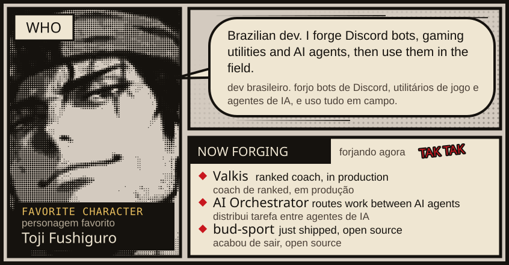
<a href="https://github.com/lipzadaxlk/lipzadaxlk/issues/new">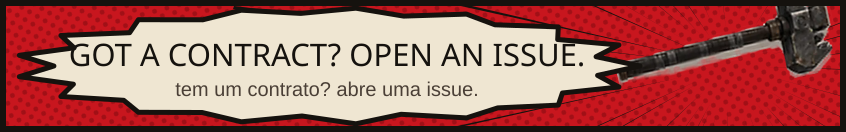</a>

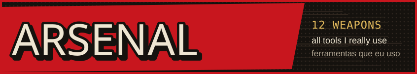
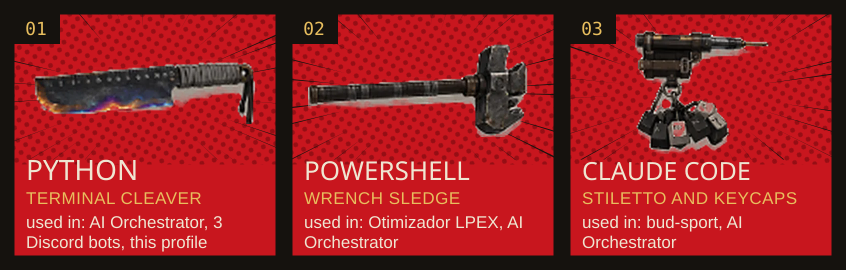
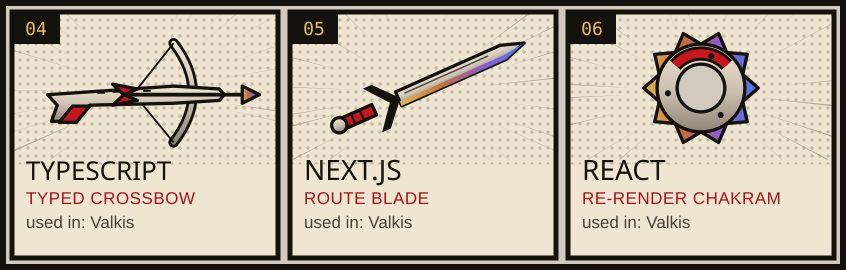
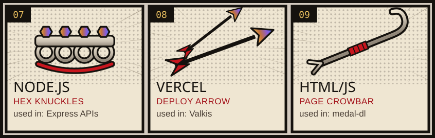
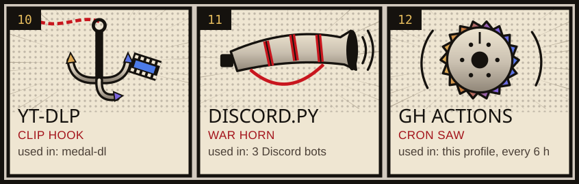

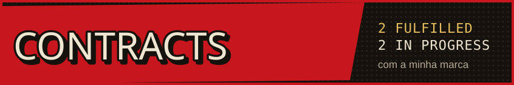
<a href="https://github.com/lipzadaxlk/bud-sport">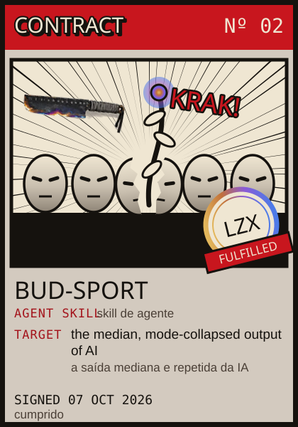</a>
<a href="https://github.com/lipzadaxlk/medal-dl">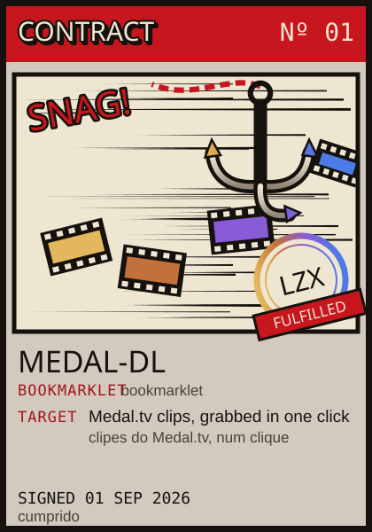</a>
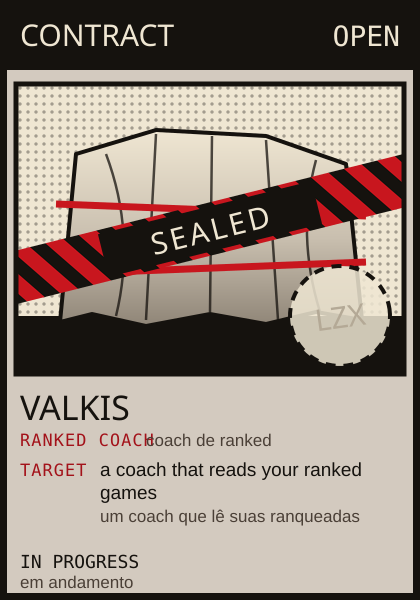
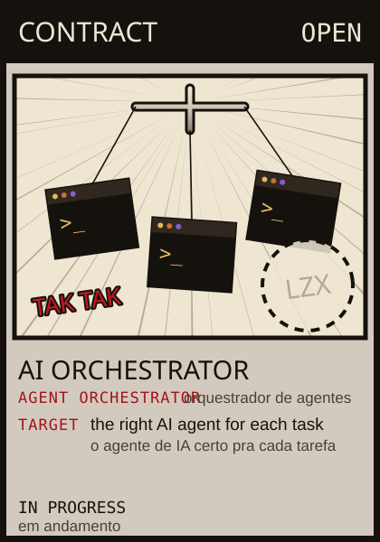

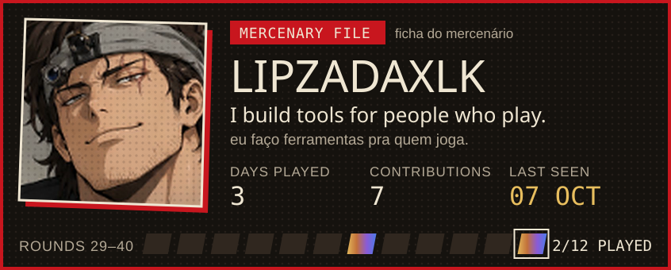

<h3></h3>

<a href="https://github.com/lipzadaxlk/bud-sport">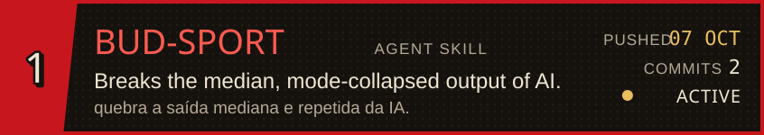</a>
<a href="https://github.com/lipzadaxlk/medal-dl">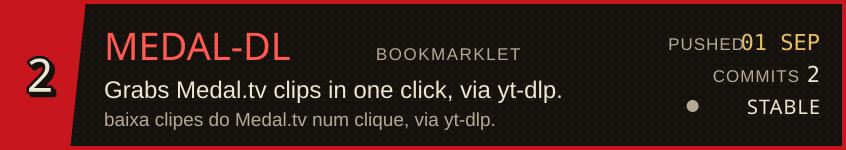</a>
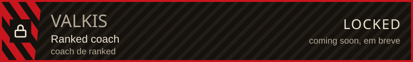
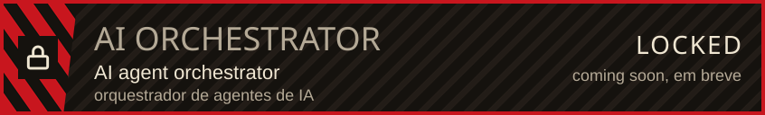
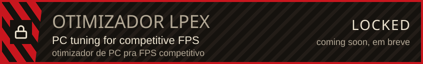
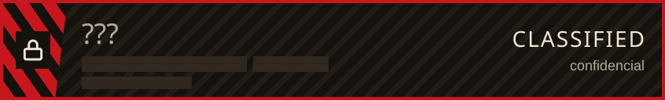

**Got a contract, a collab or just want to talk? [Open an issue](https://github.com/lipzadaxlk/lipzadaxlk/issues/new).** Tem um contrato, parceria ou só quer trocar ideia? [Abre uma issue](https://github.com/lipzadaxlk/lipzadaxlk/issues/new).

Mission log, file and loadout numbers come from the public GitHub API every 6 hours, times in BRT (UTC−3). ACTIVE = pushed in the last 30 days. Locked slots and sealed contracts are private projects that open later. The mercenary is an original character drawn for this profile. 
O registro, a ficha e o loadout vêm da API pública do GitHub a cada 6 horas. ACTIVE = push nos últimos 30 dias. Slots bloqueados e contratos lacrados são projetos privados que abrem depois. O mercenário é um personagem original feito pra este perfil.
